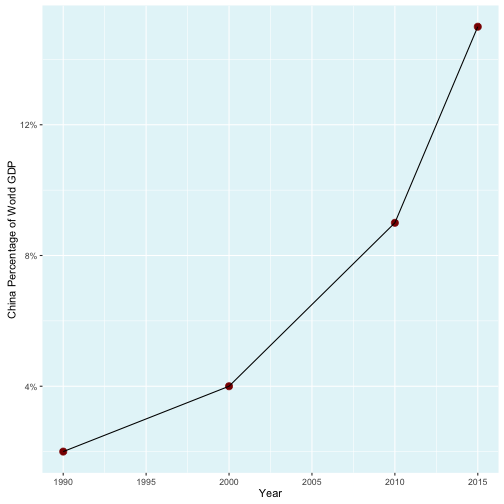

## China Becomes An Increasingly Important Driver of World Commodity Demand and Pricing

China has gained a growing proportion of the world's manufacturing capacity over the last several decades producing an ever larger fraction of the world's supply of manufactured goods. As a result China has become a much larger consumer of commodities and raw materials with increased influence on commodity demand and pricing.
(All data in this presentation is from the World Bank here: http://data.worldbank.org/indicator/NY.GDP.MKTP.CD)

---

In 1990 China's share of world GDP was around 2%. By 2015 it had grown to almost 15%.

---

Latin American economies have long relied heavily on commodity exports, from Spanish colonial shipments of precious metals to 
current exports of oil, copper, and agricultural products. To the degree that Latin American economies lean on exports they are vulnerable to changes in demand, and ultimately Chinese consumption of commodities and the effects of Chinese demand on prices.

The China/Latin America GDP Correlation Shiny App is a data visualization tool that allows the user to get a visual sense of how closely certain key Latin American economies are tied to China's.

---

The chart above is for Chile's GDP correlated with China. 
---

The closer the data points are to the regression line the more closely the data are correlated.

---
